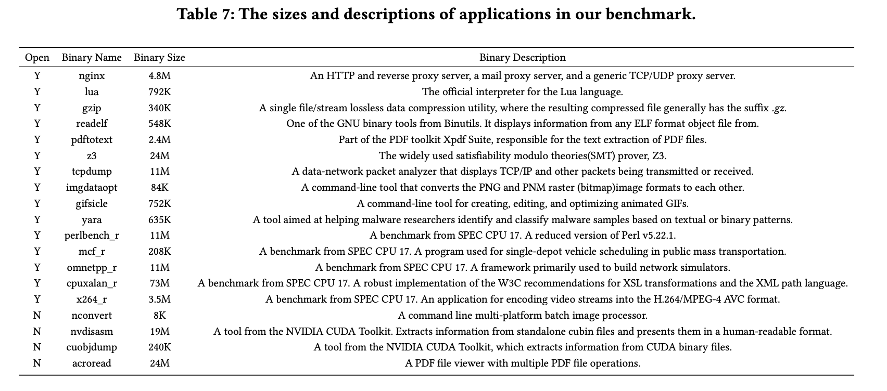

# SPFuzz(Syscall-Pattern-Feedback Fuzz)

## Installation
* SPFuzz depends on a kernel module named NoDrop. 
First, run NoDrop/scripts/getmusl.sh to get musl.
Then enter NoDrop/build and use cmake to install:
```
cmake ..
make load
```
* Use make to compile the fuzzer. 
If you need some debugging information, turn on debug mode with: 
```
make debug=1
```
and logs will reside in SPFuzz/logs/logging.

## Usage
* The usage of SPFuzz is mostly the same as AFL, some other options of SPFuzz will later be explained.
* Note that the paths on SPFuzz' panel refer to the number of syscall paths, not traditional paths.


## Benchmark Description



